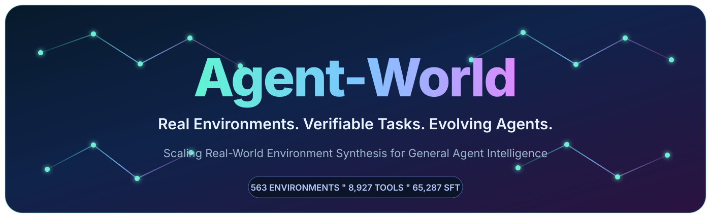

<div align="center">
  

  <h1>🌐 Agent-World</h1>
  <h3>真实环境 · 可验证任务 · 持续进化智能体</h3>

  <a href="https://arxiv.org/abs/2604.18292"></a>
  <a href="https://github.com/RUC-NLPIR/Agent-World"></a>
  <a href="https://agent-tars-world.github.io/-/"></a>
  <a href="https://huggingface.co/papers/2604.18292"></a>
  <a href="https://huggingface.co/datasets/dongguanting/Agent-World-SFT-48K"></a>
  <a href="https://www.163.com/dy/article/KS8DOH8L0511AQHO.html"></a>
  <a href="LICENSE"></a>

  <p><a href="README.md">English</a> | <strong>简体中文</strong></p>

  <p><em>把真实世界工具生态变成有状态、可执行的环境，再把环境变成可验证的智能体经验。</em></p>
</div>

<p align="center">
  <a href="#智能体-demo">Demo</a> ·
  <a href="#本次开源内容">开源内容</a> ·
  <a href="#不下载模型先检查">快速校验</a> ·
  <a href="#sft">SFT</a> ·
  <a href="#引用">引用</a>
</p>

> [!TIP]
> 不下载模型即可检查全部公开环境：`bash run.sh --check`

<table>
  <tr>
    <td align="center"><strong>563</strong><br/>个公开环境</td>
    <td align="center"><strong>8,927</strong><br/>个可执行工具</td>
    <td align="center"><strong>67,096</strong><br/>条数据库记录</td>
    <td align="center"><strong>约 48K</strong><br/>条 SFT 数据</td>
  </tr>
</table>

## 🎬 智能体 Demo

<details open>
<summary><strong>1. Agent-World 综合展示</strong></summary>
<br/>
https://github.com/user-attachments/assets/6046b0dc-7e0e-4b74-aa69-295709381aef
<p><a href="https://github.com/user-attachments/assets/6046b0dc-7e0e-4b74-aa69-295709381aef">直接打开综合展示视频</a>（如果无法内嵌播放，请使用此链接）。</p>
<p>智能体在多样真实世界环境中规划、调用可执行工具、观察状态变化并完成可验证任务。</p>
</details>

<details open>
<summary><strong>2. 机票与住宿搜索</strong></summary>
<br/>
https://github.com/user-attachments/assets/862b13ed-2cc3-4df8-bb1c-b6bf60fc107c
<p><a href="https://github.com/user-attachments/assets/862b13ed-2cc3-4df8-bb1c-b6bf60fc107c">直接打开机票与住宿搜索视频</a>（如果无法内嵌播放，请使用此链接）。</p>
<p>结合库存搜索、条件筛选、方案对比与预订相关工具交互的长程旅游任务。</p>
</details>

<details>
<summary><strong>3. 更多环境案例</strong></summary>
<br/>

[电商](https://github.com/user-attachments/assets/522d97c5-788c-4f8e-82b8-5167045f3b00) ·
[Notion](https://github.com/user-attachments/assets/3ad98e8b-b08a-4004-ba14-830db491ca3a) ·
[Slack](https://github.com/user-attachments/assets/ab4f1c38-f991-4970-a8fc-792922af25d) ·
[通信](https://github.com/user-attachments/assets/fd3f4eed-b61d-40a6-859d-3a322c2a4965) ·
[GitHub](https://github.com/user-attachments/assets/78b1082d-cc6e-4fb9-82be-2dd66cebb92a) ·
[文档操作](https://github.com/user-attachments/assets/93a35cad-75ea-4d16-88bf-288bd1486f2f) ·
[人口数据](https://github.com/user-attachments/assets/d95fcbcf-209c-4a31-8333-1d333c1604ec) ·
[Twitter](https://github.com/user-attachments/assets/f14a3d8a-4592-4bb8-9f9d-a14f926bf35c)
</details>

更多案例见[项目主页](https://agent-tars-world.github.io/-/#demos)。

## ✨ 本次开源内容

### 563 个高质量可执行环境（从 1,978 个环境中筛选）

由于每个环境都保存了丰富、真实的环境底层数据文件，**1,978 个环境**的全量原始数据规模过大，
当前仓库发布的是从中筛选出的 **Top-Used 子集**，并进一步经过质量筛选的高质量公开子集，
让数据更易于下载、检查和复现。

- 从 [Smithery](https://smithery.ai/servers) 的高使用量 MCP Server 中筛选出 **500
  个高质量主题**，优先保留使用广泛、工作流明确、工具价值较高的环境，过滤低使用量和低信息量环境；
- 从行业 PRD 与真实 Tool Documentation 中构建另外 **63 个环境**，补充公开 MCP
  生态之外的业务流程与工具场景。

它们共包含 **8,927 个可执行工具、67,096 条数据库记录、2,635 个集合**，覆盖
**20 个 L1 / 46 个 L2 / 245 个 L3** 分类，并提供覆盖 530 个环境的 **1,432 条
question/answer/rubric 示例**。

论文实验使用的原始完整语料包含 **1,978 个环境和 19,822 个工具**；当前 Git
仓库发布的是其中精选的 563 个环境及其数据库、工具代码和题目样例。

### 约 48K 条 SFT 轨迹

当前 **Agent-World SFT 数据约有 48K 条**，这是更新后的数据集版本；具体 split 和样本数以 Hugging Face 数据集页面为准。

论文中报告的原始 SFT 数据为 **40K 条轨迹**。论文发布后，我们继续进行数据合成，新增约 **8K 条轨迹**，使更新后的数据集达到约 **48K 条**。当前 Git 仓库实际公开的环境资产仍为上面的精选 563 个。

SFT 数据已发布至
[dongguanting/Agent-World-SFT-48K](https://huggingface.co/datasets/dongguanting/Agent-World-SFT-48K)；
当前仓库已经提供对应的 LlamaFactory 登记与训练说明。

环境和 question/rubric 统计可在本地复算：

```bash
python3 dataset_stats.py
```

## 目录

```text
.
├── environment_mix/
│   ├── <env_id>/                         # 可变数据库
│   ├── <env_id>_step4_checkpoint.json    # 环境介绍、工具 schema 与代码
│   ├── questions/<env_id>.json           # 可读的 question/rubric
│   ├── questions.parquet                 # 合并后的示例题库
│   ├── index.json                        # 环境分类与统计
│   └── README.md
├── graph_synth.py                        # Graph 造题链路标准入口
├── graph_syth.py                         # 兼容早期发布包的实现文件
├── prepare_git_release.py                # 移除与数据库重复的 checkpoint 载荷
├── run.sh                                # Qwen3-14B + vLLM 示例脚本
├── GRAPH_SYNTHESIS.md                    # Graph 链路详细说明
├── DATA_CARD.md                          # 数据来源、统计、限制与安全说明
├── THIRD_PARTY_NOTICES.md                # 第三方项目与再分发提示
├── requirements-vllm.txt                 # 已验证的模型服务依赖
└── training/
    ├── dataset_info.json                 # LlamaFactory 数据登记
    └── README.md                         # SFT/RL 接入说明
```

重复压缩包、模型权重、运行产物和约 3 GiB 的 SFT 语料均不进入当前 Git 仓库。

## 不下载模型先检查

```bash
bash run.sh --check
```

该命令会检查 Python/Shell 语法、发现所有 checkpoint、加载一个环境并确认其数据库目录和工具 implementation 完整，不会下载或启动模型。

## 一个环境由什么组成

每个环境有两个配对部分：

1. `environment_mix/<env_id>/`：工具实际读写的数据库文件；
2. `environment_mix/<env_id>_step4_checkpoint.json`：环境介绍、分类、数据库信息、工具 schema 和可执行 Python 代码。

例如 `0547000` 是一个 Linode 风格云环境。其数据库包含实例、基础设施目录、Kubernetes、网络安全、操作记录、存储/DNS 和请求日志等 JSON 文件。对应 checkpoint 的核心结构为：

```text
metadata
├── env_id / name / description
├── taxonomy
├── n_tools / n_collections / n_records / n_questions
└── execution_audit / verified_call

data
├── DatabaseAgent
└── ToolDesignAgent
    └── tool_schemas[]
        ├── name / description
        ├── parameters
        └── implementation
```

其中 `parameters` 是 JSON Schema，`implementation` 是可以直接加载执行的 Python 函数代码。工具通过 `MCP_DB_DIR` 定位数据库。涉及写操作时应使用数据库副本，并在隔离进程或容器中执行。

## Question 与 rubric 示例

`environment_mix/questions.parquet` 汇总了 1,432 条示例；同样的数据也按环境保存在 `environment_mix/questions/*.json`，便于阅读。每条包括：

- `task`：用户 query；
- `reference_answer`：由真实工具执行支撑的参考答案；
- `grading_rubric.success_criteria`：客观评分条件；
- `grading_rubric.verified_tool_chain`：验证该任务的工具及参数。

这些是 question/rubric 数据格式示例，与下面约 48K 条 SFT 语料不是同一批数据。

## Graph 造题链路

Graph 链路会分析工具依赖、构图并随机游走，在环境数据库的私有副本上执行工具链，再让本地模型根据真实 observation 编写 query、答案和 rubric，最后在干净副本中重放链路，过滤时间戳和随机 ID 等不稳定值。

七阶段设计、输出格式和参数见 [GRAPH_SYNTHESIS.md](GRAPH_SYNTHESIS.md)。

使用本地 Qwen3-14B 与 vLLM：

```bash
MODEL_PATH=/path/to/Qwen3-14B bash run.sh 1000

# 已有兼容的 OpenAI API 服务
bash run.sh 1000 --no-serve
```

默认输出到 `output/questions_graph.json`，日志写到 `output/logs/`。模型权重不随仓库发布。

## SFT

已发布的 SFT 数据约 **48K 条**。每条只有一个 OpenAI 风格的 `messages` 字段，角色为 `system`、`user`、`assistant`；最新的 message 统计和数据划分请以 Hugging Face 数据集卡片为准。

数据集地址：
[dongguanting/Agent-World-SFT-48K](https://huggingface.co/datasets/dongguanting/Agent-World-SFT-48K)。
使用 [LlamaFactory](https://github.com/hiyouga/LlamaFactory) 时，将
[`training/dataset_info.json`](training/dataset_info.json) 中的登记项合并到
`LlamaFactory/data/dataset_info.json`，即可从 Hugging Face 直接加载。具体配置见
[training/README.md](training/README.md)。

## RL

这些环境是有状态运行时，不是可以直接启动的 RL trainer。接入 [verl](https://github.com/verl-project/verl) 时需要修改多轮 rollout：

1. 为每条样本创建独立数据库副本；
2. 在该副本上执行模型生成的工具调用；
3. 把 observation 追加回对话；
4. 根据结构化 rubric 计算最终 reward；
5. rollout 结束后销毁副本。

[EnvScaler](https://github.com/RUC-NLPIR/EnvScaler) 可作为环境式 Agent RL 的实现参考；其公开 RL 接入基于 [ROLL](https://github.com/alibaba/ROLL) 和 [Gem](https://github.com/axon-rl/gem)，并非 verl 原生实现。[Agent-World 项目主页](https://agent-tars-world.github.io/-/#demos)也展示了旅游、电商、Notion、Slack、通信、GitHub、文档操作等环境的视频案例。整体训练代码和开源 README 组织方式可参考 [ARPO](https://github.com/RUC-NLPIR/ARPO)。

## 数据来源与安全

环境主题来自高使用量公开 MCP Server 规范、行业 PRD 与真实 Tool Documentation。发布数据库是离线研究环境状态，默认不会连接对应的真实线上服务。

部分环境会模拟认证、凭证、安全操作或用户内容，其中类似 token 的值可能是合成 fixture 或公共代码示例文本。重新分发或部署前请按自身安全与内容政策复核数据，禁止向工具 implementation 提供生产凭证。

重新分发前请同时阅读 [DATA_CARD.md](DATA_CARD.md) 和
[THIRD_PARTY_NOTICES.md](THIRD_PARTY_NOTICES.md)。

## 引用

```bibtex
@article{dong2026agent,
  title   = {Agent-World: Scaling Real-World Environment Synthesis for Evolving General Agent Intelligence},
  author  = {Dong, Guanting and Lu, Junting and Huang, Junjie and Zhong, Wanjun and
             Liu, Longxiang and Huang, Shijue and Li, Zhenyu and Zhao, Yang and
             Song, Xiaoshuai and Li, Xiaoxi and Jin, Jiajie and Zhu, Yutao and
             Wang, Hanbin and Lei, Fangyu and Luo, Qinyu and Chen, Mingyang and
             Chen, Zehui and Feng, Jiazhan and Wen, Ji-Rong and Dou, Zhicheng},
  journal = {CoRR},
  volume  = {abs/2604.18292},
  year    = {2026},
  url     = {https://arxiv.org/abs/2604.18292}
}
```
